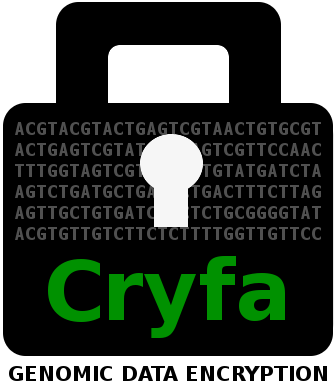

<p align="center"></p>
<br>

Cryfa is a FASTA/FASTQ compression and encryption tool.
It uses AES (Advanced Encryption Standard) for the purpose of encryption.
Cryfa can be applied to any FASTA or FASTQ file (DNA sequences, headers and
quality-scores).
Compacting 3 DNA bases into 1 char, it uses a fixed block size packing.
Compared with general compression tools, it allows to decrease the file size by
a factor of 3, without creating security problems such as those derived from 
CRIME or BREACH attacks.


## INSTALL
Get cryfa and make the project, using:
```bash
git clone https://github.com/pratas/cryfa.git
cd cryfa
cmake .
make
```


## RUN
If you want to run cryfa in stand-alone mode, use the following command:
```bash
./cryfa [OPTION]... -k [KEY_FILE] [-d] [IN_FILE] > [OUT_FILE]
```
For example, to compress:
```bash
./cryfa -k pass.txt in.fq > comp
```
and, to decompress:
```bash
./cryfa -k pass.txt -d comp > orig.fq
```
Options are described in the following section.

If you want to compare cryfa with other methods, set the parameters in 
**run.sh** bash script, then run it:
```bash
./run.sh
```
With this script, you can download the datasets, install the dependencies, 
install the compression and encryption methods and finally, run them.


### OPTIONS
To see the possible options, type:
```bash
./cryfa -h
```

which provides the following:
```bash
SYNOPSIS
      ./cryfa [OPTION]... -k [KEY_FILE] [-d] [IN_FILE] > [OUT_FILE]

SAMPLE
      Compression   & Encryption:   ./cryfa -k pass.txt in.fq > comp     
      Decompression & Decryption:   ./cryfa -k pass.txt -d comp > orig.fq

DESCRIPTION
      Compress and encrypt FASTA/FASTQ files.

      The KEY_FILE specifies a file including the password.

      -h,  --help
           usage guide

      -k [KEY_FILE],  --key [KEY_FILE]
           key file name -- MANDATORY

      -d,  --decrypt
           decryption

      -v,  --verbose
           verbose mode (more information)

      -s,  --disable_shuffle
           disable input shuffling

      -t [NUMBER],  --thread [NUMBER]
           number of threads
```

Cryfa uses standard input and ouput streams, hence, it can be directly 
integrated with pipelines.


## CITE
Please cite the following, if you use cryfa:
* D. Pratas, M. Hosseini and A.J. Pinho, "Cryfa: a tool to compact and encrypt
FASTA files," *11'th International Conference on Practical Applications of 
Computational Biology & Bioinformatics* (PACBB), Springer, June 2017.


## RELEASES
* [Release](https://github.com/pratas/cryfa/releases) 2: FASTA and FASTQ 
handling.
* [Release](https://github.com/pratas/cryfa/releases) 1: FASTA handling.

## ISSUES
Please let us know if there is any 
[issues](https://github.com/pratas/cryfa/issues).


## LICENSE
Cryfa is under GPL v3 license. For more information, click 
[here](http://www.gnu.org/licenses/gpl-3.0.html).