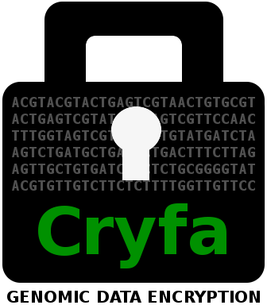
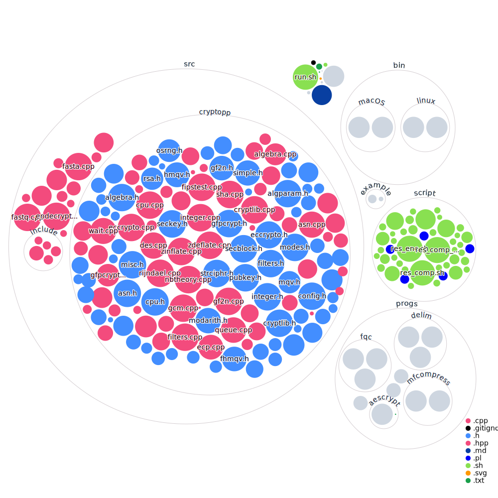

<p align="center"></p>

[](LICENSE)
[](https://github.com/cobilab/cryfa/actions/workflows/ci.yml)

Cryfa is an ultrafast encryption tool specifically designed for genomic data. Besides providing robust security, it also compresses FASTA/FASTQ sequences by a factor of three, making it an efficient solution for managing genomic data.

# Installation

## Conda

```bash
conda install -c bioconda -y cryfa
```

## Docker

```bash
# Pull & Run the image
docker pull smortezah/cryfa;
docker run -it smortezah/cryfa;
```

## Build from source

### Linux

```bash
# Install git and cmake
sudo apt update;
sudo apt install git cmake;

# Clone and install Cryfa
git clone https://github.com/cobilab/cryfa.git;
cd cryfa;
sh install.sh;
```

### macOS

```bash
# Install Homebrew, git and cmake
/usr/bin/ruby -e "$(curl -fsSL https://raw.githubusercontent.com/Homebrew/install/master/install)";
brew install git cmake;

# Clone and install Cryfa
git clone https://github.com/cobilab/cryfa.git;
cd cryfa;
sh install.sh;
```

> [!NOTE]
> Pre-compiled versions of Cryfa, optimized for 64-bit Linux and macOS, can be found in the `bin/` directory.

# Usage

To execute Cryfa in stand-alone mode, utilize the command below:

```bash
./cryfa [OPTION]... -k [KEY_FILE] [-d] [IN_FILE] > [OUT_FILE]
```

For instance, to compact and encrypt data, execute the following command:

```bash
./cryfa -k pass.txt in.fq > comp
```

To decrypt and unpack the data, execute the command below:

```bash
./cryfa -k pass.txt -d comp > orig.fq
```

A sample file, "in.fq", is available in the example/ directory. Detailed descriptions of the options are provided in the subsequent sections.

> [!NOTE]
> Cryfa supports a maximum file size of 64 GB. For larger files, consider splitting them into smaller chunks, e.g. using the `split` command in Linux, and then encrypt each chunk separately. After decryption, you can reassemble the chunks using the `cat` command.

## Input file format
Cryfa identifies the format of a genomic data file by examining its content, not its extension. For instance, a FASTA file named "test" can be input into Cryfa with any extension, such as "test", "test.fa", "test.fasta", "test.fas", "test.fsa", etc. Based on this, executing the command

```bash
./cryfa -k pass.txt test > comp
```

is equivalent to running

```bash
./cryfa -k pass.txt test.fa > comp
```

> [!NOTE]
> The password file extension is not a limiting factor for Cryfa. It can have any extension or even no extension at all. For instance, "pass", "pass.txt", "pass.dat", and so on, are all valid and yield the same result.

## Benchmarking Cryfa Against Other Methods

To benchmark Cryfa against other methods, configure the parameters in the **run.sh** bash script and execute it:

```bash
./run.sh
```

This script automates the process of downloading datasets, installing dependencies, setting up compression and encryption tools, executing these tools, and finally, displaying the results.

# Options

To explore the available options in Cryfa, execute the command below:

```bash
./cryfa
```

which will yield the following:

```
SYNOPSIS
      ./cryfa [OPTION]... -k [KEY_FILE] [-d] [IN_FILE] > [OUT_FILE]

SAMPLE
      Encrypt and compact:  ./cryfa -k pass.txt in.fq > comp     
      Decrypt and unpack:   ./cryfa -k pass.txt -d comp > orig.fq
      
      Encrypt:              ./cryfa -k pass.txt in > enc
      Decrypt:              ./cryfa -k pass.txt -d enc > orig

OPTIONS
      Compact & encrypt FASTA/FASTQ files.
      Encrypt any text-based genomic data, e.g., VCF/SAM/BAM.

      -k [KEY_FILE],  --key [KEY_FILE]
           key file name -- MANDATORY
           The KEY_FILE should contain a password.
           To make a strong password, the "keygen" program can be
           used via the command "./keygen".

      -d,  --dec
           decrypt & unpack
           
      -f,  --force
           force to consider input as non-FASTA/FASTQ
           Forces Cryfa not to compact, but shuffle and encrypt.
           If the input is FASTA/FASTQ, it is considered as
           non-FASTA/FASTQ; so, compaction will be ignored, but 
           shuffling and encryption will be performed.
           
      -s,  --stop_shuffle
           stop shuffling the input

      -t [NUMBER],  --thread [NUMBER]
           number of threads

      -v,  --verbose
           verbose mode (more information)
      
      -h,  --help
           usage guide

      --version
           version information
```

Cryfa leverages the standard output stream, allowing seamless integration with existing data processing pipelines.

## Creating a Key File

There are two approaches to create a "KEY_FILE" that can be used with the `-k` or `--key` flags. You can either save a raw password in a file or use the provided "keygen" program to generate a robust password. The latter method is strongly recommended for enhanced security.

To utilize the first method, use the commands below to save a raw password in a file, which can then be passed to Cryfa. In this example, "Such a strong password!" is the raw password and "pass.txt" is the file where the password is stored. Alternatively, you can use a text editor to save the password in a file:

```bash
echo "Such a strong password!" > pass.txt
./cryfa -k pass.txt IN_FILE > OUT_FILE
```

While the password must contain at least 8 characters, it's highly recommended to use a strong password for better security. A strong password:

- Is at least 12 characters long
- Includes a mix of lowercase (a-z) and uppercase (A-Z) letters, digits (0-9), and symbols (e.g., !, #, $, %, and })
- Is not a simple repetition of characters (e.g., zzzzzz), a keyboard pattern (e.g., qwerty), or a sequence of digits (e.g., 123456)

Alternatively, you can leverage the "keygen" program to automatically generate a robust password. To do this, execute:

```bash
./keygen
```

You'll be prompted with:

```text
Enter a password, then press 'Enter':
```

At this point, input a raw password, for example, "A keygen raw pass!", and press "Enter". Subsequently, you'll see:

```text
Enter a file name to save the generated key, then press 'Enter':
```

The robust password generated by the "keygen" program will be stored in the file you specify, such as "key.txt". Note that "keygen" requires an initial raw password to generate a strong password, but this initial password doesn't need to be particularly strong. Once the key file is created, you can use it with Cryfa as shown below:

```bash
./cryfa -k key.txt IN_FILE > OUT_FILE
```

For a deeper understanding of "key management" - which encompasses the generation, exchange, storage, usage, and replacement of keys - consider exploring [[1]](https://en.wikipedia.org/wiki/Key_management), [[2]](https://info.townsendsecurity.com/definitive-guide-to-encryption-key-management-fundamentals), [[3]](https://csrc.nist.gov/projects/key-management/cryptographic-key-management-systems) and [[4]](https://www.cryptomathic.com/news-events/blog/what-is-key-management-a-ciso-perspective).

# Citation

If you utilize Cryfa in your research, please acknowledge the tool by citing the following references:

- M. Hosseini, D. Pratas and A.J. Pinho, "Cryfa: a secure encryption tool for genomic data," *Bioinformatics*, vol. 35, no. 1, pp. 146--148, 2018. [DOI: 10.1093/bioinformatics/bty645](https://doi.org/10.1093/bioinformatics/bty645)
- **[OPTIONAL]** D. Pratas, M. Hosseini and A.J. Pinho, "Cryfa: a tool to compact and encrypt FASTA files," *11'th International Conference on Practical Applications of Computational Biology & Bioinformatics* (PACBB), Springer, June 2017. [DOI: 10.1007/978-3-319-60816-7_37](https://doi.org/10.1007/978-3-319-60816-7_37)

# Codebase



# License

Cryfa is licensed under the [GPLv3](http://www.gnu.org/licenses/gpl-3.0.html).
