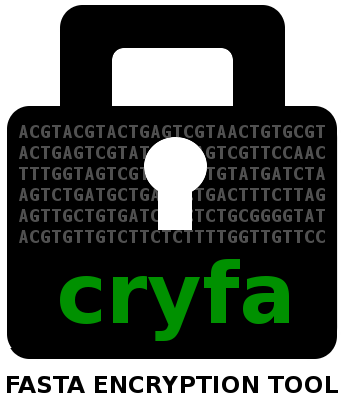

<p align="center"></p>
<br>

Cryfa is a FASTA/FASTQ compaction plus encryption tool.
It uses AES (Advanced Encryption Standard) for the purpose of encryption.
Cryfa can be applied to any FASTA or FASTQ file (DNA sequences, headers and quality-scores).
It compacts 3 DNA bases into 1 char, using a fixed block size packing.
When compared with general compression tools, it allows to decrease the file size by a factor of 3, without creating security problems such as those derived from CRIME or BREACH attacks.


## INSTALLATION
First, get cryfa using:
```bash
git clone https://github.com/pratas/cryfa.git
```
Then, if you want to run cryfa in stand-alone mode, use the following command:
```bash
cmake . | make | ./cryfa [OPTION]... -k [KEY_FILE] [INPUT_FILE] > [OUTPUT_FILE]
```
As an example:
```bash
cmake . | make | ./cryfa -t 8 -k pass.txt in.fa > out
```
If you want to download datasets and compare cryfa with other methods, you should set the parameters in **run.sh**, which is an all-in-one bash script.

Finally, run the **run.sh** script using:
```bash
./run.sh INPUT_FILE > OUTPUT_FILE
```
Please note that when the parameter *CRYFA_COMP_DECOMP_COMPARE* is set to 1, compression, decompression and comparing results will be carried out. In this case, **run.sh** script must be run without redirection symbol, *>*, in the following way:
```bash
./run.sh INPUT_FILE OUTPUT_FILE
```

## PARAMETERS
Cryfa executable is a file called **cryfa**. To see the possible options, if this executable is not yet made, you should make it, first, using:
```bash
cmake .
make
```
Then you can type
```bash
./cryfa -h
```

This will print the following options:
```bash
Synopsis:
    cryfa [OPTION]... -k [KEY_FILE] [INPUT_FILE]

Options:
    -h,  --help
         usage guide

    -k [KEY_FILE],  --key [KEY_FILE]
         key file name -- Mandatory

    -d,  --decrypt
         decryption

    -v,  --verbose
         verbose mode (more information)

    -s,  --disable_shuffle
         disable shuffling input

    -t [NUMBER],  --thread [NUMBER]
         number of threads

    -a,  --about
         about cryfa
```
Cryfa uses standard input and ouput streams, hence, it can be directly integrated with pipelines.

## CITATION
Please cite the followings, if you use cryfa:
* D. Pratas, M. Hosseini and A.J. Pinho, "Cryfa: a tool to compact and encrypt FASTA files," *11'th International Conference on Practical Applications of Computational Biology & Bioinformatics* (PACBB), Springer, June 2017.

## RELEASES
https://github.com/pratas/cryfa/releases:

* Release 2: FASTA and FASTQ handling (in development).
* Release 1: FASTA handling.

## ISSUES
Please let us know if there is any [issues](https://github.com/pratas/cryfa/issues).

## LICENSE
Cryfa is under GPL v3 license. For more information, click [here](http://www.gnu.org/licenses/gpl-3.0.html).