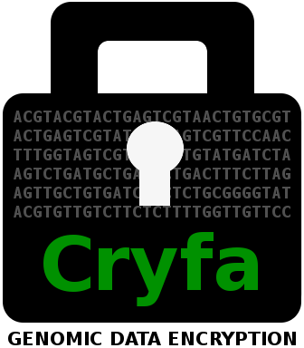

<p align="center"></p>

[](https://anaconda.org/bioconda/cryfa)
[](https://anaconda.org/bioconda/cryfa)
[](https://github.com/cobilab/cryfa/actions/workflows/ci.yml)
[](LICENSE)

Cryfa is an ultrafast encryption tool specifically designed for genomic data. Besides providing robust security, it also compresses FASTA/FASTQ sequences by a factor of three, making it an efficient solution for managing genomic data.

## Installation

### Conda

```sh
conda install -y bioconda::cryfa
```

### Docker

The image is available for **linux/amd64** and **linux/arm64** (Apple Silicon, AWS Graviton).

```sh
# Pull the image
docker pull smortezah/cryfa

# Encrypt (mount the directory containing your key file and input)
docker run --rm -v /path/to/data:/data smortezah/cryfa \
    -k /data/pass.txt /data/in.fq > out.crf

# Decrypt
docker run --rm -v /path/to/data:/data smortezah/cryfa \
    -k /data/pass.txt -d /data/out.crf > restored.fq
```

### Build from source

#### Linux

```sh
# Install git and cmake (≥ 4.0)
sudo apt update;
sudo apt install git python3-pip;
pip3 install cmake;

# Clone and install Cryfa
git clone https://github.com/cobilab/cryfa.git;
cd cryfa;
sh install.sh;
```

#### macOS

```sh
# Install Homebrew, git and cmake
/bin/bash -c "$(curl -fsSL https://raw.githubusercontent.com/Homebrew/install/HEAD/install.sh)";
brew install git cmake;

# Clone and install Cryfa
git clone https://github.com/cobilab/cryfa.git;
cd cryfa;
sh install.sh;
```

#### Windows

```powershell
# Install CMake and Visual Studio Build Tools (requires winget)
winget install --id Kitware.CMake --source winget
winget install --id Microsoft.VisualStudio.2022.BuildTools --source winget

# Clone and install Cryfa
git clone https://github.com/cobilab/cryfa.git
cd cryfa
.\install.ps1
```

> [!NOTE]
> Pre-compiled binaries for 64-bit Linux, macOS, and Windows are available as assets on the [Releases](https://github.com/cobilab/cryfa/releases) page.

## Usage

Run Cryfa with:

```sh
./cryfa [OPTION]... -k [KEY_FILE] [-d] [IN_FILE] > [OUT_FILE]
```

For example, to compact and encrypt:

```sh
./cryfa -k pass.txt in.fq > comp
```

To decrypt and unpack:

```sh
./cryfa -k pass.txt -d comp > orig.fq
```

A sample file, `in.fq`, is available in the `example/` directory.

> [!NOTE]
> Cryfa supports a maximum file size of 64 GB. For larger files, consider splitting them into smaller chunks, e.g. using the `split` command in Linux, and then encrypt each chunk separately. After decryption, you can reassemble the chunks using the `cat` command.

### Input file format

Cryfa identifies the format of a genomic data file by examining its content, not its extension. For instance, a FASTA file named `test` can be provided with any extension — `test`, `test.fa`, `test.fasta`, `test.fas`, `test.fsa`, etc. So, running

```sh
./cryfa -k pass.txt test > comp
```

is equivalent to running

```sh
./cryfa -k pass.txt test.fa > comp
```

> [!NOTE]
> The password file can have any extension or none at all -- `pass`, `pass.txt`, `pass.dat`, etc. are all valid and yield the same result.

### Options

Cryfa supports the following options:

| Option | Long form        | Argument   | Required | Description                                                                 |
| ------ | ---------------- | ---------- | -------- | --------------------------------------------------------------------------- |
| `-k`   | `--key`          | `KEY_FILE` | Yes      | Key file containing the password. Use `./keygen` to generate a strong one.  |
| `-d`   | `--dec`          |            | No       | Decrypt and unpack the input file.                                          |
| `-f`   | `--force`        |            | No       | Force non-FASTA/FASTQ mode: skip compaction, but still shuffle and encrypt. |
| `-s`   | `--stop_shuffle` |            | No       | Disable shuffling of the input.                                             |
| `-t`   | `--thread`       | `NUMBER`   | No       | Number of threads to use.                                                   |
| `-v`   | `--verbose`      |            | No       | Enable verbose mode for more detailed output.                               |
| `-h`   | `--help`         |            | No       | Display the usage guide.                                                    |
|        | `--version`      |            | No       | Display version information.                                                |

> [!NOTE]
> Cryfa can compact and encrypt FASTA/FASTQ files, or encrypt any other text-based genomic data (e.g., VCF, SAM, BAM) without compaction.

Cryfa leverages the standard output stream, allowing seamless integration with existing data processing pipelines.

### Creating a Key File

There are two ways to create a `KEY_FILE` for use with `-k` / `--key`: save a raw password in a file, or use the `keygen` program to generate a strong one. The latter is strongly recommended.

To use the first method, save a raw password to a file (e.g., `pass.txt`) and pass it to Cryfa. You can use any text editor or run:

```sh
echo "Such a strong password!" > pass.txt
./cryfa -k pass.txt IN_FILE > OUT_FILE
```

While the password must contain at least 8 characters, it's highly recommended to use a strong password for better security. A strong password:

- Is at least 12 characters long
- Includes a mix of lowercase (a-z) and uppercase (A-Z) letters, digits (0-9), and symbols (e.g., !, #, $, %, and })
- Is not a simple repetition of characters (e.g., zzzzzz), a keyboard pattern (e.g., qwerty), or a sequence of digits (e.g., 123456)

To use `keygen` instead, run:

```sh
./keygen
```

You'll be prompted with:

```text
Enter a password, then press 'Enter':
```

Enter a raw password (e.g., `A keygen raw pass!`) and press Enter. You'll then see:

```text
Enter a file name to save the generated key, then press 'Enter':
```

The generated key will be saved to the file you specify (e.g., `key.txt`). Note that `keygen` requires an initial raw password, but it doesn't need to be particularly strong. Use the resulting key file with Cryfa:

```sh
./cryfa -k key.txt IN_FILE > OUT_FILE
```

To learn more about key management (generation, exchange, storage, usage, and replacement of keys), see [[1]](https://en.wikipedia.org/wiki/Key_management), [[2]](https://info.townsendsecurity.com/definitive-guide-to-encryption-key-management-fundamentals), [[3]](https://csrc.nist.gov/projects/key-management/cryptographic-key-management-systems) and [[4]](https://www.cryptomathic.com/news-events/blog/what-is-key-management-a-ciso-perspective).

### Benchmarking Cryfa Against Other Methods

To benchmark Cryfa against other methods, configure the parameters in the **bench_cryfa.sh** bash script and execute it:

```sh
./bench_cryfa.sh
```

This script automates the process of downloading datasets, installing dependencies, setting up compression and encryption tools, executing these tools, and finally, displaying the results.

For quick local performance and correctness checks, use the local harness:

```sh
sh scripts/runtime/run_local_perf.sh --label local-check --input example/in.fq --target-mb 200 --threads "1 4 8" --runs 1 --modes both --no-prompt
```

The local harness expands the seed input to the requested size, measures compression and decompression, verifies every round trip with `cmp`, and writes CSV/Markdown reports under `results/local_perf/`.

## Citation

If you use Cryfa in your research, please cite the following references:

- M. Hosseini, D. Pratas and A.J. Pinho, "Cryfa: a secure encryption tool for genomic data," _Bioinformatics_, vol. 35, no. 1, pp. 146--148, 2018. [DOI: 10.1093/bioinformatics/bty645](https://doi.org/10.1093/bioinformatics/bty645)
- **[OPTIONAL]** D. Pratas, M. Hosseini and A.J. Pinho, "Cryfa: a tool to compact and encrypt FASTA files," _11'th International Conference on Practical Applications of Computational Biology & Bioinformatics_ (PACBB), Springer, June 2017. [DOI: 10.1007/978-3-319-60816-7_37](https://doi.org/10.1007/978-3-319-60816-7_37)

## License

Cryfa is licensed under the [GPLv3](http://www.gnu.org/licenses/gpl-3.0.html).
